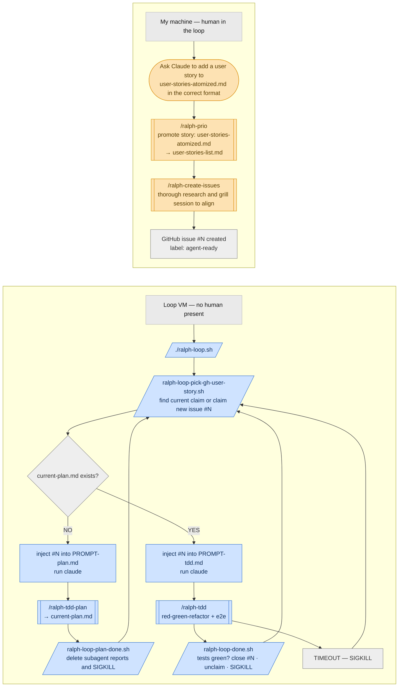

# AI-INFRA — reusable AI development infrastructure

Everything needed to run **Claude Code in a Docker dev-container** and drive a project with the
**Ralph loop** (autonomous, issue-driven, TDD user-story building), extracted from the used in a
project where it was battle-tested over multiple weeks of headless building.

**How to use this repo:** copy its contents into a new project, work through the
[setup checklist](#2-new-project-setup-checklist), and you have the same working environment —
skills, agents, loop scripts, container.

**Contents**

1. [What this is + repo map](#1-what-this-is--repo-map)
2. [New-project setup checklist](#2-new-project-setup-checklist)
3. [Docker dev-container guide](#3-docker-dev-container-guide)
4. [Ralph loop operations manual](#4-ralph-loop-operations-manual)
5. [The docs the loop builds against](#5-the-docs-the-loop-builds-against) ← architecture-spec, reference projects
6. [E2E testing setup](#6-e2e-testing-setup)
7. [Skills index](#7-skills-index)
8. [Maintaining the template](#8-maintaining-the-template)

---

## 1. What this is + repo map

Three subsystems, designed to work together but usable separately:

- **Docker dev-container** — a container image with Claude Code, gh, node, python, Playwright
  runtime libs and shared OAuth credentials, so any project gets an identical, disposable agent
  environment (`Dockerfile`, `docker-compose.yml`, `run-claude.sh`, `docker_setup/`).
- **Ralph loop** — the autonomous issue runner: label GitHub issues `agent-ready`, start
  `ralph/ralph-loop.sh`, and it plans + builds them one story at a time in capped, fresh-context
  iterations, gated on green tests and proof-of-work commits (`ralph/`, the four `ralph-*` skills).
- **Skills + agents** — the working-practice layer: authoring skills that produce loop-ready
  issues, TDD knowledge, retros, debugging discipline, local agents (`AI-Info/`, `.claude/`,
  `.agents/`).

```
├── README.md                    ← you are here
├── CLAUDE.md                    ← starter project instructions (CUSTOMIZE)
├── .env.claude.example          ← container env template (copy to .env.claude, fill in)
├── .mcp.json                    ← Playwright MCP server (e2e browser driving)
├── skills-lock.json             ← provenance of vendored skills
├── Dockerfile / docker-compose.yml / docker-entrypoint.sh / run-claude.sh
├── docker_setup/                ← modular container setup scripts + config.sh (CUSTOMIZE image name)
├── ralph/                       ← the loop: runner, picker, done-gate, drift handler, 2 prompts
├── scripts/
│   ├── dev-up.sh                ← FAIL-FAST SKELETON: implement per its header contract
│   └── run-tests.sh             ← FAIL-FAST SKELETON: implement per its header contract
├── AI-Info/
│   ├── architecture-spec.md     ← skeleton: the LOCKED design authority (fill §3/§7/§8 first)
│   ├── software-architecture.md ← skeleton: map of existing seams
│   ├── reference-projects/      ← design prototypes live here (see §5 — crucial for UI)
│   ├── docs/user-story-list.md  ← backlog index (+ user-story-list/ track files)
│   ├── implementation-plans/    ← plan template + gitignored current/ scratchpad
│   ├── local-agents/            ← tech-ranger (feature work) + meta-agent (agent-system work)
│   └── skills/                  ← skill source of truth (symlinked into .claude/skills/)
├── .claude/                     ← settings, commands (agent wrappers), skill symlinks
├── .agents/skills/              ← vendored external skills (systematic-debugging, security-review,
│                                   improve-codebase-architecture)
└── examples/klara/              ← REAL filled-in versions: dev-up.sh, run-tests.sh, CLAUDE.md,
                                    the KF-flavoured ralph-prio / ralph-create-issues
```

Everything that needs a project-specific value carries a **`CUSTOMIZE`** marker. The
`examples/klara/` folder shows what each blank looks like filled in on a real project — when a
skeleton's contract is unclear, read the Klara version.

---

## 2. New-project setup checklist

### 2.1 Get the files in

**New project:**
```bash
git clone <this-repo> my-project && cd my-project
rm -rf .git && git init   # detach from the template's history
```

**Existing repo:** rsync everything except the template's git history and examples:
```bash
rsync -av --exclude .git --exclude examples/ <template-dir>/ <project-dir>/
```
(Keep `examples/` out of real projects — it's reference material; read it from the template.)

### 2.2 Work the CUSTOMIZE list

```bash
grep -rn "CUSTOMIZE" . --exclude-dir=.git --exclude-dir=examples --exclude-dir=node_modules
```
Every hit is a decision only you can make. The big ones:

| File | What to fill |
|---|---|
| `docker_setup/config.sh` | `IMAGE_NAME` — the project's docker image name |
| `scripts/run-tests.sh` | your real test commands (it **exits 1 on purpose** until you do) |
| `scripts/dev-up.sh` | start/stop/health-wait/seed for your stack (also fail-fast until implemented) |
| `CLAUDE.md` | project name, stack, test commands, dev URLs, seeded login |
| `AI-Info/architecture-spec.md` | the locked design (fill §3 module map, §7 decisions, §8 build order first) |
| `AI-Info/software-architecture.md` | map of the existing seams |
| `AI-Info/skills/ralph-*/SKILL.md` | the few inline CUSTOMIZE notes (key dirs, seeded login, ports) |

### 2.3 Container + credentials

```bash
cp .env.claude.example .env.claude    # fill GIT_TOKEN (fine-grained PAT); leave API key empty for OAuth
./run-claude.sh --build               # first build; later just ./run-claude.sh
```
Claude OAuth credentials live in a **shared docker volume** (`claude-credentials`) — log in once,
every project's container reuses it. On macOS the token also auto-syncs from the Keychain
(`docker_setup/sync-claude-token-from-keychain.sh`).

### 2.4 GitHub one-time setup (needed for the Ralph loop)

```bash
gh auth status                                   # must succeed inside the container
gh label create agent-ready                      # the loop's queue label
gh label create claimed-ralph-0                  # one per loop id you'll run (0..3)
git checkout -b ralph-loop && git push -u origin ralph-loop   # the loop's single work branch
```

### 2.5 Verify before looping

1. `./scripts/run-tests.sh` → green (on a fresh clone of your project).
2. `./scripts/dev-up.sh` → returns healthy; you can log in with the seeded account.
3. Start `claude` in the container → `/ralph-prio`, `/grill-me` etc. appear as skills.
4. Author work: `/ralph-prio` (stock the backlog) → `/ralph-create-issues` (grill → issues).
5. `./ralph/ralph-loop.sh` — watch the first iteration end-to-end before leaving it alone.

---

## 3. Docker dev-container guide

### The image

`Dockerfile` builds a Debian (node:20-bookworm-slim) image with: git, python3 + venv, build
tools, sqlite3, MySQL client libs, Docker CLI (for docker-in-docker), **GitHub CLI**,
**cloudflared** (quick-tunnels so external webhooks can reach your dev backend), **Claude Code**
+ **Heroku CLI** (npm globals), Playwright's Chromium runtime libs, and **peon-ping** (terminal
notification sounds, relay-mode to the host). Trim what you don't use — everything past the base
tooling is optional.

Two baked-in env decisions to know about (rebuild to change):
- `CLAUDE_CODE_EFFORT_LEVEL=xhigh` — applies container-wide and **overrides per-launch
  `--effort` flags**.
- `DISABLE_AUTOUPDATER=1`, `EDITOR=nano`, npm prefix on PATH.

### run-claude.sh

```bash
./run-claude.sh           # start (or attach to) the dev container
./run-claude.sh --build   # rebuild the image no-cache first (needed after Dockerfile edits)
```
It sources `docker_setup/config.sh`, loads `.env.claude`, mounts the repo at `/workspace` and the
shared `claude-credentials` volume, and hands off to `docker-entrypoint.sh` (root: runs the
`docker_setup/` modules — git credentials, playwright, shell, statusline, peon-ping relay — then
drops to the `app` user).

### docker_setup/ modules

One script per concern; `config.sh` holds the shared values (image name, volume name, relay
host/port, keychain service). `STATUSLINE.md` + `install-statusline.sh` set up the status line;
`setup-peon-ping-docker.md` documents the notification relay. All optional pieces degrade
gracefully if you delete them.

---

## 4. Ralph loop operations manual

### The loop in one picture

Two halves: issues are authored with a human present, then the loop VM plans and builds them with
no human present.



### Creating the issues the loop builds (the human half)

The loop only builds what an issue pins down, so issue creation happens with a human present.
Run `/ralph-create-issues` on a story from `AI-Info/docs/user-story-list.md`: it researches the
codebase and the architecture spec, then grills you until every open decision is settled and
records the answers **verbatim** in one loop-ready GitHub issue per story (acceptance criteria,
`Blocked by` refs, and for UI stories the design-reference pointer). The issue is labelled
`agent-ready`, which is what puts it in the loop's queue.

### Mental model

The loop turns **GitHub issues into shipped, tested code with no human present**. Each iteration:

1. **Pick + claim** — `ralph-loop-pick-gh-user-story.sh` resumes the issue this loop already
   claimed (label `claimed-ralph-<id>`), else claims the lowest open unclaimed `agent-ready`
   issue whose `Blocked by` refs are all closed. Emits `MODE=plan|tdd`.
2. **Run a capped, fresh `claude` session** seeded with the matching prompt:
   - `MODE=plan` → `ralph/PROMPT-plan.md` → `/ralph-tdd-plan` researches (subagent fan-out →
     verify → reconcile) and writes the checkbox plan to
     `AI-Info/implementation-plans/current/current-plan.md`. Gets 1.5× the time budget.
   - `MODE=tdd` → `ralph/PROMPT-tdd.md` → `/ralph-tdd` builds from the on-disk plan: one
     subagent per step, red-green-refactor, one commit per green slice (`#<N> step k: …`),
     a single Playwright e2e subagent, push to `ralph-loop`.
3. **SIGKILL at the timeout** (default 1400s build / 2100s plan — set in `ralph-loop.sh`). No
   context carries over; git history + the plan file + the claim label are how the next
   iteration resumes.
4. **Done-gate** — `ralph-loop-done.sh --issueDone <N>` closes the issue **only** when a commit
   referencing `#N` is on `origin/ralph-loop` (proof-of-work) **and** `./scripts/run-tests.sh`
   is green. Then it releases the claim and clears the plan.

The loop stops when the picker reports the queue empty, when `ralph/.ralph-status` says `DONE`,
or on Ctrl-C.

### Why it's shaped this way (the invariants — don't break these)

- **Fresh context per iteration** beats one long session: no compaction drift, and a SIGKILL
  costs one slice, not the run. Durability lives in **git history** (what landed), the **plan
  file** (the decided route), and **GitHub labels** (who owns what).
- **The issue is the spec.** Fresh-context iterations build exactly what the issue pins down and
  invent the rest — which is why `/ralph-create-issues` records decisions **verbatim**.
- **Green-gated advance.** An issue can't close on red or without a pushed commit referencing
  it; a half-done slice can't corrupt the queue.
- **Orchestrator delegates.** The session is an Opus orchestrator (pinned to a 1M context via
  `ANTHROPIC_DEFAULT_OPUS_MODEL` in `ralph-loop.sh`) dispatching cheap Sonnet subagents — one
  per plan step, never a span. This Opus-lead/Sonnet-worker split beat solo-Opus on cost and
  reliability in Anthropic's and our experience.

### Running it

```bash
# inside the container (./run-claude.sh):
./ralph/ralph-loop.sh
```

**Stopping:** Ctrl-C any time. From inside a session: `./ralph/ralph-loop-done.sh --issueDone <N>`
(end this iteration) or `./ralph/ralph-loop-done.sh` (whole loop done — bash exits next iteration).

**Monitoring:** `git log --oneline origin/ralph-loop` (slices landing), `gh issue list --label
agent-ready` (queue), `gh issue list --label claimed-ralph-0` (what each loop holds), plus the
runner's stderr log.

### Concurrency — up to 4 loops

One loop per **clone** of the repo, keyed by `RALPH_LOOP_ID` (0..3) in each clone's
`.env.claude`. All loops push to the single `origin/ralph-loop` branch; the per-loop
`claimed-ralph-<id>` label is the whole concurrency model (cross-loop dedup + self-resume after
SIGKILL). Non-fast-forward pushes are expected and handled: fetch, `pull --no-rebase`, resolve
in-tree, re-green, retry (never rebase, never force-push). `dev-up.sh` must offset ports by
`RALPH_LOOP_ID` so clones' stacks don't collide.

### Failure modes you'll actually see

| Symptom | What's happening | Handler |
|---|---|---|
| Loop re-picks the same issue | That's resume-by-claim working — plan exists, build continues | nothing to do |
| Plan's `Issue: #N` ≠ claimed issue | claim↔plan drift (stale plan from another issue) | `ralph-issue-drift.sh` unclaims, clears plan, restarts clean |
| Issue gets a comment "blocked: …" and stays open | the autonomy contract: underspecified issue / missing dependency — the agent must not guess | fix the issue body, re-run |
| Iteration ends with uncommitted changes | SIGKILL mid-slice | next iteration inspects, finishes or discards that one slice |
| Done-gate refuses to close | no `#N` commit on origin, or red suite | that's the gate doing its job |

---

## 5. The docs the loop builds against

Autonomous building only works when the *deciding* has already happened somewhere the agent can
read. Three artifacts carry that, and the ralph skills link to all three by path — keep the
paths.

### `AI-Info/architecture-spec.md` — the unified, LOCKED design authority

One document that reconciles every partial spec/draft/prototype and **wins over all of them**.
The skeleton ships with the section structure proven on Klara; §3 (module map), §7 (locked
decisions) and §8 (build order) are what the pipeline leans on hardest — `/ralph-create-issues`
cites §7/§8 in every issue, `/ralph-tdd-plan` structures new modules per §3, `/ralph-tdd`
inherits §7 instead of re-deriving decisions. Without this document, every fresh-context
iteration re-litigates settled questions — with it, disagreement between docs has one arbiter.

### `AI-Info/software-architecture.md` — the map of what exists

Where the current seams live (persistence, auth, notifications, API client, UI models) and the
"adding a feature" playbook. The planning fan-out verifies seams against it; issues reference
its sections instead of copying them (copies go stale; links don't).

### `AI-Info/reference-projects/` — validated prototypes

**CRUCIAL for UI work and EXTREMELY helpful for architecture questions** — this is the
highest-leverage prep you can do before letting the loop touch UI:

- A validated, high-fidelity prototype **is the UX spec**: `/ralph-create-issues` walks it
  screen-by-screen with you (states, exact copy, unhappy paths), the issue links the exact
  prototype file + README section, and the build recreates it — styling verbatim — instead of
  inventing screens. A UI story with no design-reference pointer isn't finished — and when a
  story has **neither a suitable reference nor an existing in-app pattern**,
  `/ralph-create-issues` **flags it and parks it**: UI design work has to happen before the loop
  can successfully execute that story.
- For architecture questions, a working prototype is the fastest authority: behaviour you can
  read beats prose you can misread. The planning fan-out has a dedicated design-reference pass.

Layout convention and the "prototype ≠ production code" rules are in
`AI-Info/reference-projects/README.md`. If you have no prototype yet, build one *before*
authoring UI tracks — on Klara this paid for itself many times over.

---

## 6. E2E testing setup

- **Playwright MCP** (`.mcp.json`): headless, isolated Chromium via `@playwright/mcp`,
  screenshots to `.playwright-mcp/`, browsers cached in `.cache/ms-playwright`. The container
  image already carries Chromium's OS libs; `docker_setup/setup-playwright.sh` handles the rest.
- **`./scripts/dev-up.sh` is the e2e contract**: restartable, health-waited, seeded login,
  per-loop port offsets. The `/ralph-tdd` e2e step assumes exactly this contract — implement the
  skeleton's header and e2e "just works".
- **One browser, one driver**: the e2e journey always runs in a **single** subagent (parallel
  drivers fight over the shared browser). Assert on `browser_snapshot` DOM state, not
  screenshot eyeballing; screenshots are for the visual gate against the design reference.
- **Mock the boundaries**: every issue's E2E plan carries a "What Claude CANNOT verify" section —
  real external services (payments, SMS, LLM, calendars) are mocked at their ports.

---

## 7. Skills index

Source of truth: `AI-Info/skills/<name>/SKILL.md`, symlinked into `.claude/skills/` (Claude Code
discovers them at session start). Vendored external skills live in `.agents/skills/` with
provenance in `skills-lock.json`. Full index with descriptions: `AI-Info/skills/README.md`.

| Family | Skills | Notes |
|---|---|---|
| Ralph authoring (human-present) | `/ralph-prio`, `/ralph-create-issues` | backlog → grilled, loop-ready issues |
| Ralph build (headless) | `/ralph-tdd`, `/ralph-tdd-plan` | invoked by the loop's prompts, not by you |
| Working practice | `/grill-me`, `/systematic-debugging`, `/security-review`, `/improve-codebase-architecture`, `/workflow-retro`, `/quick-workflow-retro` | |
| Skill-writing | `/how-to-create-a-skill`, `/how-to-write-ai-instructions` | |
| Reference docs | `how-to-TDD.md`, `how-to-write-modular-code.md` + the TDD knowledge files inside `ralph-tdd/` | not slash-commands |

Local agents (`.claude/commands/` → `AI-Info/local-agents/`): **`/tech-ranger`** for focused
interactive implementation work, **`/meta-agent`** for working on this agent system itself.

---

## 8. Maintaining the template

- **This repo is the canonical copy.** Projects get plain file copies (no submodules, no
  subtrees — copies never break a project's build).
- **Backporting:** when you improve a script/skill inside a project, diff it against the
  template and port the generic part back:
  `diff -ru <template>/ralph <project>/ralph` (same for `AI-Info/skills`, `docker_setup`).
  Strip project specifics back into `CUSTOMIZE` markers as you port.
- **Vendored skills** (`.agents/skills/`): re-fetch from the sources in `skills-lock.json` to
  update; update the lock's hash when you do.
- **Keep `examples/klara/` frozen** — it's a snapshot of a known-working configuration, not a
  living copy. Replace it wholesale from the Klara repo if you ever want a newer snapshot.
- **Never commit `.env.claude`** — only `.env.claude.example`. The template's `.gitignore`
  already enforces this; keep it that way in projects too.
